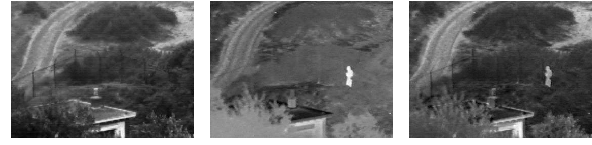

# Fast and Efficient Zero-Learning Image Fusion
[[Home]](http://fayez.me)

Official implementation of Fast and Efficient Zero-Learning Image Fusion.
**Faster** and **Higher Quality** image fusion using pre-trained neural networks.

## Overview

This is the author's implementation of medical image fusion using pre-trained neural networks described in:

**Fast and Efficient Zero-Learning Image Fusion**  
Fayez Lahoud, Sabine Süsstrunk

Given a set of pre-aligned images, our algorithm geneates a high quality fusion reflecting the relevant features from all the inputs, independant of network architecture and depth. Our method can be applied to different fusion tasks (thermal, medical, focus, exposure, etc.), and accepts any numbre of source images.

Contact: Fayez Lahoud (fayez.lahoud@epfl.ch)